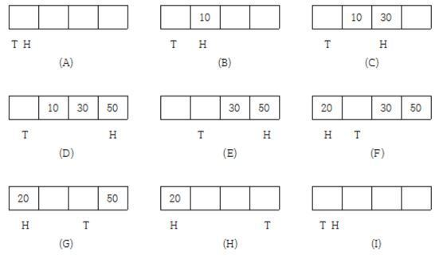

# 13일차 STUDY & TASK   
* TASK   
    > Circular Queue 만들기
    > 선형 큐의 문제점을 개선하기 위해 고안(= 큐의 포화 상태와 빈(empty) 상태를 구별하지 못함)   
    > 큐의 한 칸을 비워두고 이것을 포화 상태와 빈(empty) 상태를 구분하기 위해 사용한다.   
       
    > C언어로 구현하고 queue와 test 코드는 파일을 분리하여 만든다   
    > test 코드 샘플   
    ```cpp
    #include <iostream>
    #include "RingBuffer.h"

    int main()
    {
        char str[81] = "1234567890 abcdefghijklmnopqrstuvwxyz 1234567890 abcdefghijklmnopqrstuvwxyz 1234";
        int x = 0;
        int y = 0;
        char buf[200];
        char vs[100];
        int ran;
        InitBuffer(80);                                     //버퍼 초기화, 사이즈 지정
        while (1)
        {
            memset(buf, 0x00, sizeof(buf));
            memset(vs, 0x00, sizeof(vs));
            x += InqueueBuffer(str + x, rand() % (81 - x)); //InqueueBuffer(data, length)
            if (x >= 80)
                x = 0;
            ran = rand() % 80;
            PeekBuffer(vs, ran);                            //버퍼의 내용이 사라지지 않고 읽음
            y = DequeueBuffer(buf, ran);                    //버퍼의 내용을 지우면서 읽음
            if (memcmp(vs, buf, ran) != 0)
                break;
            buf[y] = '\0';
            printf("%s", buf);
        }
        return 0;
    }
    ```
    > 이후 네트워크 프로그램을 만들 때 recive 버퍼로 사용할 예정   
    
[To main](/README.md)