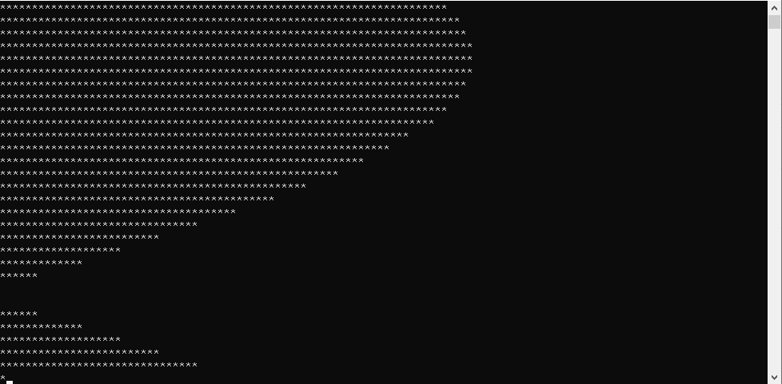

# 2일차 STUDY & TASK
* TASK
    > unsigned int 변수 바이트 단위 제어   
    > unsigned int 변수 0 초기화   
    > 키보드로 1 ~ 4 바이트 위치 입력, 키보드로 해당 위치에 넣을 데이터 0 ~ 255 입력   
    > 입력 완료후 바이트 단위로 쪼개서 출력 & unsigned int 변수 16진수 출력   
    > **이전 실행의 결과는 보존되어야 한다**   

    > sine 그래프 *로 출력   
    > TIP) sin 함수 사용   
    > 50ms마다 5도씩 증가   
    > 각도 범위 0~180도   
    > *의 최대 갯수 80개   
    > 그러므로 sin 함수의 결과에 80을 곱한 값만큼 *을 찍는다   

## sine 그래프 과제 참고 이미지   

[To main](/README.md)